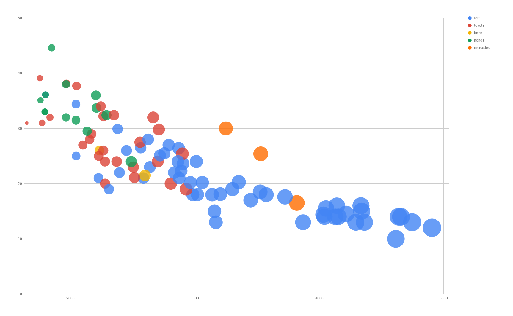
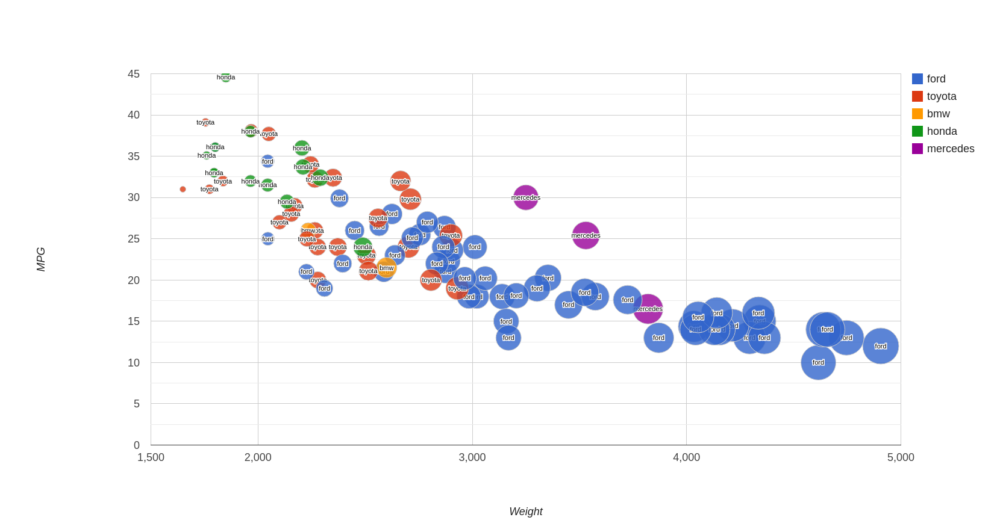
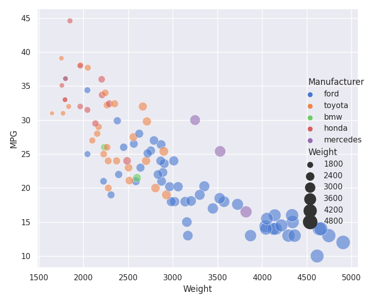
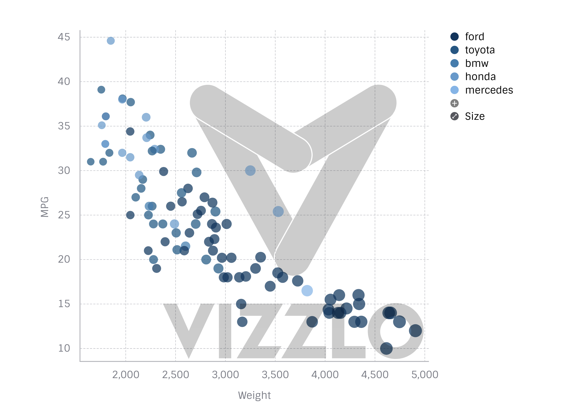
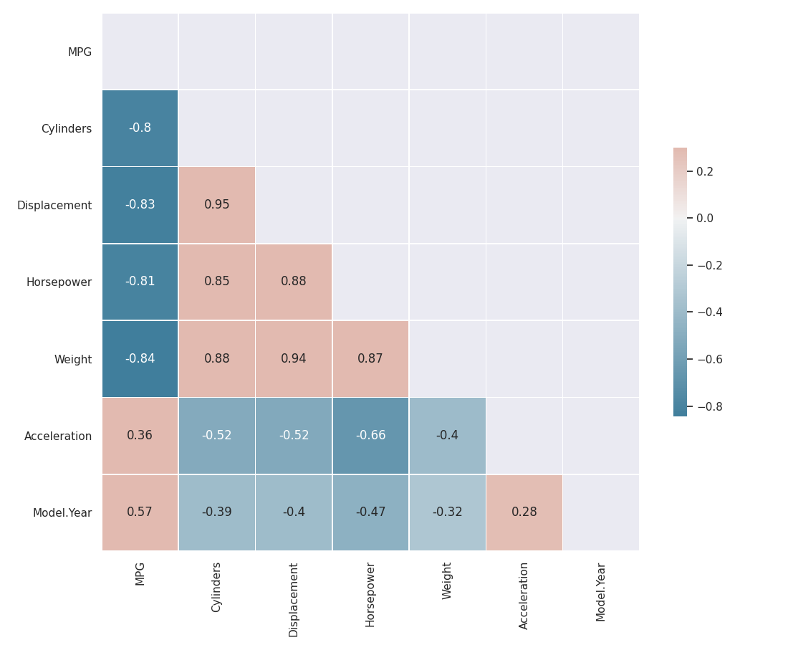

# 02-DataVis-7ways

Assignment 2 - Data Visualization, 7 Ways  
===

D3 Viz
------
It took a while to find the correct examples, but once I found them, it was rather straightforward to put together the visualization code. Obviously, there is a strict requirement to have a good understanding of SVG and javascript to work with D3, which would affect the coding experience more than the access to the sample code. 

R Viz
------
Working on the R code requires a good understanding of writing code in R and ggplot2. Although the setup can be timeconsuming R has an excellent documentation and stackoverflow community for support so it's very straightforward and easy to work with. 

Flourish Viz
------
Flourish has a very intuitive UI and anyone who can drag and drop files around a PC can use flurish to generate the visualization.

The viz was generated using the online editor for [flourish](https://app.flourish.studio/visualisation/5408923/).

Google Spreadsheet Viz
------
This took a while to figure out as I initially tried to generate the visualization using LibreOffice Calc, which to put it mildly was a huge mistake. The guides for google spreadsheet are not very good or readily available but if you have access to Excel tutorials then you can easily replicate the work in google spreadsheet.

Google Charts Viz
------
The google charts visualization is very straight forward and some level of understanding of JavaScript, HTML, CSS and JSON will easily help you figure out the visualization. Additionally, google charts has excellent documentation which is very helpful. If anything Google products are often over engineered and the only problem I had with Google Charts was reading through unnecessary and heavily redundant documentation. 

Matplotlib Viz
------
Working with Matplotlib requires understanding knowledge of dataframes, numpy, and other python libraries that are dependencies associated with matplotlib.

Seaborn Viz
------
Similar to working with Matplotlib, Seaborn requires understanding knowledge of dataframes, numpy, and other python libraries that are dependencies associated with matplotlib and seaborn.

Vegalite Viz
------
If you understand JSON and have access to vegalite documentation and examples then working with vegalite is very straightforward and simple. 

The viz was generated using the vegalite [online editor](https://vega.github.io/editor/#/examples/vega-lite/circle_bubble_health_income). The json code is in the vegalite folder. If you replace the default json with the custom json I wrote then the chart will get rendered.

Visslo Viz
------
Visslo has a very intuitive UI and anyone who can drag and drop files around a PC can use visslo to generate the visualization. The free version has limited features which can make things difficult if you want to use the images on documents.

The Visslo viz was generated using the visslo online editor.

## Technical Achievements
The technical achievements associated with this project revolved around the missing na values in the data for MPG. The weight, displacement and horsepower all were correlated more strongly than the traditional measure that people are more interested when talking about engines 'The number of Cylinders'. However the sparsity of the data made the data particularly hard to cluster into groups. I ended up binning the data into 5 bins(pentiles). The mean of the bins were then used to generate the missing data in the MPG.
The heat map of the correlation matrix can be seen below:

### Design Achievements
- **Re-vamped Apple's Design Philosophy**: As demonstrated in my colorscheme...
